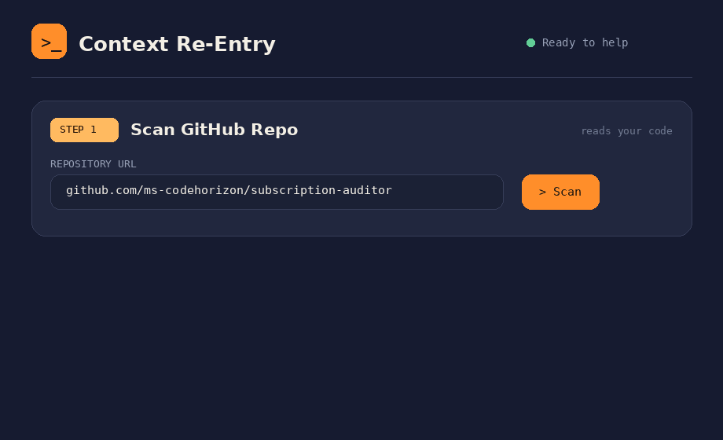
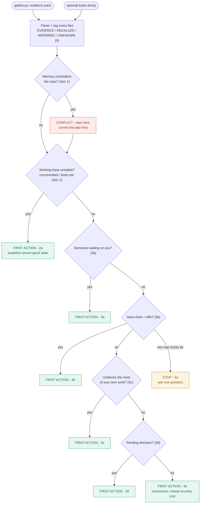

# 🧭 Context Re-Entry Specialist

An AI specialist whose brain is auditable markdown, and that doesn't lean on my memory.
I point it at a repo I haven't touched in days. It reads the trail I left behind
(commits, uncommitted work, branches, touched files, stale TODOs) and hands me back a
re-entry map: where I was, the open decision, what's resolved or not, and the single
first action to take. I read it in 90 seconds and I'm working on the right thing.

The part that earns its keep: when my memory contradicts the repo, it flags the
conflict and the repo wins, so I don't waste an hour rebuilding something I already
deleted. [`CASE-STUDY.md`](CASE-STUDY.md) shows exactly that, on a real repo.

I built this for myself. I run three client projects plus a side build, and every time
I switch I lose 30 to 45 minutes just remembering where I was and why. This is the tool
I wished I had.



## 🧪 For reviewers - test it in 60 seconds

Zero install, no key: open the [live demo](https://ms-codehorizon.github.io/context-reentry/)
and click **Try Demo**. It replays a real run on my own repo and shows the headline (it
catches a memory that contradicts the git history). Then paste any public repo URL into
Step 1, hit **Scan**, and **Copy prompt** into your own LLM.

Drop the folder into Claude (the ICM-native test):

1. New Claude Project, then upload this folder (or at least `identity.md`, `rules.md`, and `reference/`).
2. Paste the ready-made example from [`EXAMPLE-INPUT.md`](EXAMPLE-INPUT.md). It's one block: a real evidence pack plus a wrong memory. A correct run flags the conflict and tells you not to rebuild a backend I'd already deleted. Expected result is in [`CASE-STUDY.md`](CASE-STUDY.md).

With your own project: run `python3 gather.py /path/to/any/repo` and paste its output
with the instruction at the top of `EXAMPLE-INPUT.md`.

## Why memory-based re-entry doesn't work

Every "jot down where you left off" habit I've tried has the same two holes. First, if
I could remember enough to write it down, I've already paid half the re-entry cost.
Second, and worse, my memory is often wrong: I think I finished something that's
actually uncommitted with red tests, or I forget I deleted a whole subsystem. So this
starts from evidence, not recall, and treats my memory as a hypothesis to check against
the repo.

There's a quiet fit with the methodology here. ICM is about loading the right context
into an agent. This is a specialist for re-loading the right context into me, from the
ground truth I already committed.

## How it decides

The rules short-circuit. Reality gets corrected first, then safety, then the ranked
actions, and the doc names the rule behind every call so I can audit it.



## Try it

1. Collect the evidence (read-only, it only reads git and files):

```
python3 gather.py /path/to/your/repo  > evidence.md
```

2. Hand it to the specialist. Drop this folder into a Claude Project (or any assistant
that accepts files) and say:

> Act as the specialist defined in this folder. Here's my evidence pack: ...
> (optionally) and a brain-dump: ...

Or use the interface: just open `interface/index.html` in any browser (no server, no
install - the specialist files are bundled into the page). Scan a GitHub repo (public is
free, private uses an optional token) or pick a local folder (any modern browser), or
paste a `gather.py` pack. Then optionally add a brain-dump and watch the recorded demo,
run live with your own key, or copy the assembled prompt into any LLM. `gather.py` stays
the deepest source, since only it sees uncommitted diffs and TODOs.

Note: the page bundles the specialist `.md` files as `interface/specialist.js`. If you
edit a `.md`, regenerate that bundle (or ask the assistant to) so the page stays in sync.

Stranger test: you don't have to be me. Any developer with a git repo can run
`gather.py` and get a re-entry map for their own chaos. The rules carry no private
context, they're all in `rules.md`.

## How the brain works

| File | Job |
|---|---|
| `brief.md` | The client brief, the real problem this solves (read first) |
| `gather.py` | The evidence collector, turns a repo's trail into ground truth |
| `identity.md` | Scope: what the specialist owns, refuses, and its evidence-first posture |
| `rules.md` | Numbered logic, in order: 0 intake/tagging, 1 reconcile memory vs repo, 2 safety-first, 3 rank actions, 4 FIRST ACTION, 5 STOP. First rule that fires wins. |
| `examples.md` | Four worked runs, including the conflict-catch and an honest STOP |
| `CASE-STUDY.md` | A real run on a real repo, with a real false memory caught |
| `COLD-TEST.md` | Three unseen scenarios run cold through the folder; the calls match mine |
| `EXAMPLE-INPUT.md` | A paste-ready evidence pack so anyone can test in one shot |
| `reference/input-template.md` | Evidence-first input (brain-dump optional) |
| `reference/reentry-doc-template.md` | The map the specialist returns |
| `reference/priority-rubric.md` | The ranking detail behind Section 3 |
| `reference/reentry-schema.md` | JSON output contract for the interface's live mode |
| `interface/` | The page, with zero re-entry logic inside |

Design rules I borrowed from ICM: every fact has one home, specs say what not how, and
ambiguity is illegal. Even ties have a written tiebreaker, and a guess is never allowed
to masquerade as a remembered fact.

## What makes the output trustworthy

Evidence over memory. It reconstructs from the repo, not my recall, and labels every
fact EVIDENCE, RECALLED, INFERRED, or UNKNOWN (rules.md 0b).

It catches my false memories. When recall and repo disagree, it flags a CONFLICT and
corrects to reality, the highest-value thing it does (Section 1).

One FIRST ACTION, always justified. It cites the rule it won on and what it beat, never an
arbitrary "do this first" (rules.md 4a).

Safety outranks ambition. An unstable base sends me to "establish known-good state"
before any feature work (Section 2).

It decides, but knows when not to. Two narrow cases make it stop and ask one question:
two real deadlines it can't rank, or no evidence and too-thin recall (Section 5).

---
Built as an exercise in ICM (folder-as-architecture): re-entry logic you can read, diff,
and trust.
